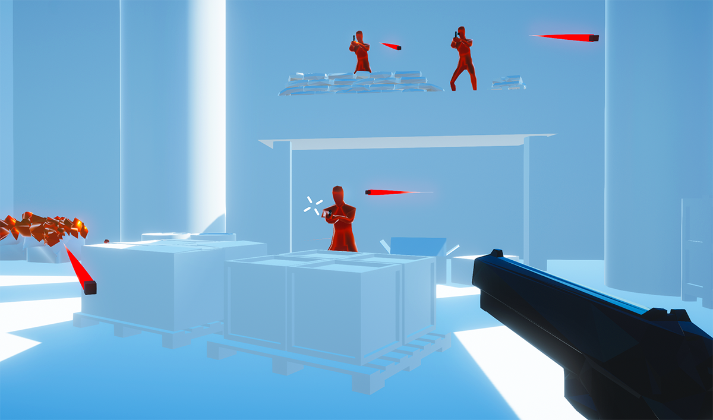
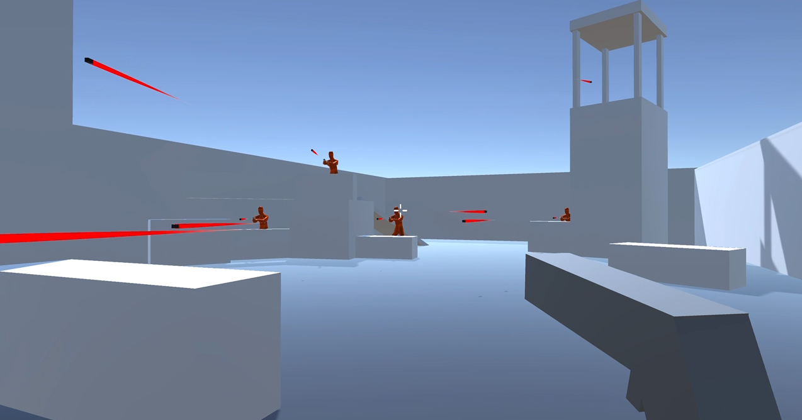
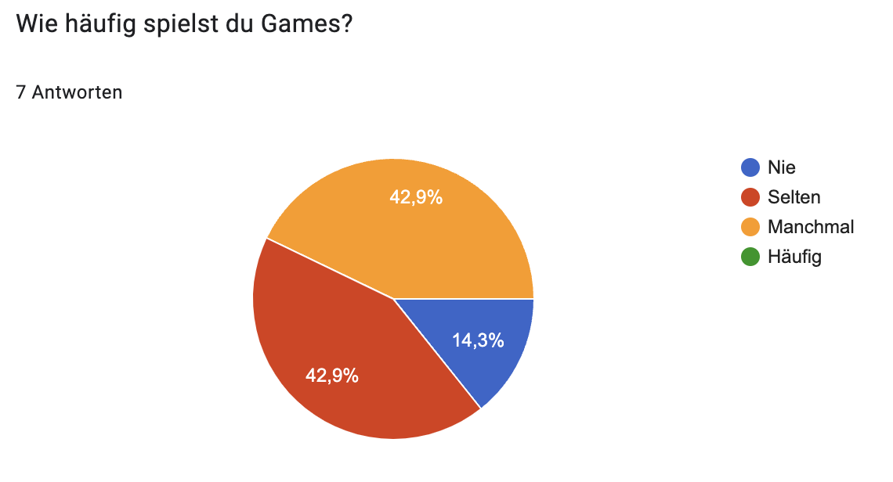
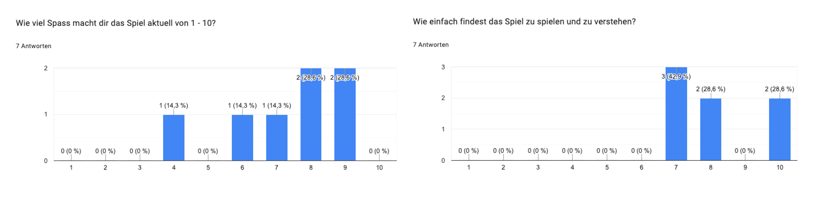

# SuperHot – GAMEDEV HS23

Dies ist die Dokumentation des Projekts «SuperHot», eine Abgabe innerhalb des Moduls «Game Development» von Nico Schneider und Elia Rohrbach.

## Grundidee

Unsere Umsetzung des Spiels «SuperHot» ist eine Nachstellung des gleichnamigen Shooters vom Entwickler «SUPERHOT Team», welches im Februar 2016 erstmalig für Windows, Linux und macOS erschienen ist. Die Grundmechanik des First-Person Shooters basiert auf den klassischen Mechaniken eines Shooters, wobei der Spieler innerhalb eines Levels mehrere Gegner mit verschiedenen Waffen bekämpft. Jedoch bewegt sich die Zeit innerhalb des Spiels nur, wenn sich der Spieler bewegt. Das ermöglicht dem Spieler, seine Situation in Slow-Motion zu analysieren und entsprechend zu reagieren, was eine taktische Komponente ins Spiel einfliessen lässt.

Als Fans des Shooters haben wir uns entschieden, innerhalb des Moduls Game Development die Mechanik und visuellen Elemente von SuperHot nachzubauen. Daraus entstand unsere Version des Shooters, wobei wie beim Originalspiel auch die Gameengine Unity verwendet wurde.

### Anleitung

Unsere Umsetzung von SuperHot übernimmt die gängigsten Steuerelemente eines First-Person Shooters.
Die Steuerungsmechaniken sind wie folgt:

- Tasten «WASD»: Bewegung des Spielers nach vorne, links, hinten und rechts.
- Leertaste: Springen
- Linke Maustaste: Schuss mit Waffe
- Taste «R»: Neustarten des Levels

## Functional Requirements, Non-Functional Requirements and Risks

### Functional Requirements

Folgende Requirements wurden vor der Arbeit am Projekt ausgearbeitet. Die Estimates befinden sich jeweils in der Klammer.

- Zeit der Szene und der Gegner wird mit Bewegungen des Spielers verknüpft (large)
- Basic-Playercontroller: Spieler kann Laufen und Springen (small)
- Mind. ein Spiellevel (medium)
- Mind. drei Gegner im Level zum Bekämpfen (large – inkl. Modell, Animation, Particle Effects)
- Mind. ein Waffentyp mit Projektil (Bsp. Pistole), der vom Spieler eingesetzt werden kann (medium)
- Mind. ein Sound-Effekt, der sinnvoll im Spiel eingesetzt wird (small)
- Spieler kann sterben (medium)
- Spieler und Gegner sterben bei einmaligem Treffer/Schaden (small)
- Spieler kann das Level neu starten (small)

### Non-Functional Requirements

- Die Waffe ist für den Spieler sichtbar (small)
- Das Projektil der Waffe ist für den Spieler sichtbar (small)
- Ein Level muss Deckung für den Spieler bieten (small)

### Risks

- Die Implementation einer Zeit-Konstante (Slow-Motion) ist schwieriger als angenommen und wir scheitern möglicherweise an einer sauberen und fliessenden Umsetzung.
- Die Intelligenz bzw. das Verhalten der Gegner fällt zu primitiv aus.
- Der vorgenommene Umfang des Spiels ist zu gross und passt nicht in den zeitlichen Umfang des Projekts.
- Jemand aus der Gruppe fällt krankheitsbedingt für längere Zeit aus.

#### Evaluation der Risks

- Die Implementation der Slow Motion war für uns gut umsetzbar und hat bereits im frühen Entwicklungsstadium funktioniert.
- Wegen der Deadline stehen unsere Gegner aktuell still. Durch den Raycast und die Rotation auf die Kamera konnten wir jedoch eine gewisse Intelligenz simulieren.
- Der Umfang war im Rahmen dieses Projekts nicht zu gross und hat zeitlich gereicht.
- Glücklicherweise ist niemand von uns für längere Zeit ausgefallen.

## Code

### Bullet-Time (Slow-Motion) Effekt

Der Bullettime Effekt wird über den Input des Spielers gesteuert. Sobald ein Bewegungsinput von der X- oder Y-Achse kommt, wird die Timescale des Spiels zwischen den Werten 1f und 0.03f, mit einer geschwindigkeit von 0.5f bzw. 0.05f interpoliert.

        float horizontalInput = Input.GetAxisRaw("Horizontal");
        float verticalInput = Input.GetAxisRaw("Vertical");

        float time = (horizontalInput != 0 || verticalInput != 0) ? 1f : .03f;
        float lerpTime = (horizontalInput != 0 || verticalInput != 0) ? .05f : .5f;

        Time.timeScale = Mathf.Lerp(Time.timeScale, time, lerpTime);

### BulletSpawner Script

Der BulletSpawner ist eine abstrakte Klasse welche an die BulletSpawner der Gegner und des Spielers vererbt wird.

        public abstract class BulletSpawner : MonoBehaviour

        public class BulletSpawnerEnemy : BulletSpawner

        public class BulletSpawnerPlayer : BulletSpawner

Das Script spawnt die Kugel, verhindert eine Schussabgabe solange der Cooldown nicht abgelaufen ist und spielt das Partikelsystem ab, welches als Muzzleflash dient.

        protected void spawnBullet(Vector3 spawnPosition, Quaternion spawnRotation) {
            if (Time.time > passedCooldownTime)
            {
                muzzleFlash.Play();
                Instantiate(bulletPrefab, spawnPosition, spawnRotation);
                passedCooldownTime = Time.time + gunCooldown;
            }
        }

#### BulletSpawnerPlayer

Speziell beim Spieler wird das Crosshair, welches als Zielhilfe dient, während dem Waffen-Cooldown um 90° gedreht um den Cooldown zu signalisieren.

        if (Time.time < passedCooldownTime)
        {
            float newCrosshairRotation = crosshair.transform.rotation.eulerAngles.z + (angleVelocity * Time.deltaTime);
            crosshair.transform.rotation = Quaternion.Euler(0, 0, newCrosshairRotation);
        }

#### EnemyController

Damit die Gegner auch eine Gefahr für den Spieler darstellen, müssen sie auch in die Richtung des Spielers schiessen. Wir haben keine komplexen Methoden implementiert wie beispielweise einen Vorhalt in die Richtung des Spielers. Der Gegner dreht sich immer automatisch in die Richtung des Spielers.

        Vector3 directionToCamera = Camera.main.transform.position - transform.position;
        directionToCamera.y = 0;
        Quaternion lookRotation = Quaternion.LookRotation(directionToCamera);
        transform.rotation = Quaternion.Slerp(transform.rotation, lookRotation, Time.deltaTime * speed);

#### BulletSpawnerEnemy

Ist jedoch ein Gegner in einer erhöhten Position schiesst dieser gerade aus und somit über den Spieler. Mithilfe eines Raycasts wird der Winkel zum Spieler ermittelt und die Kugel mit dem entsprechende Winkel gespawnt.

        Physics.Raycast(rayOrigin, rayDirection, out hit, Mathf.Infinity);

        if (hit.collider.tag == "Player")
        {
            float rayHitAngle = 180 - Vector3.Angle(rayDirection, hit.normal);
            Quaternion parentRotation = GetComponentInParent<Transform>().rotation;

            Quaternion bulletSpawnRotation = Quaternion.Euler(rayHitAngle, parentRotation.eulerAngles.y, parentRotation.eulerAngles.z);
            spawnBullet(bulletSpawnPoint.position, bulletSpawnRotation);
        }

### BulletBehaviour

Das Verhalten einer Kugel ist sehr simpel. Sie wird mit einem Prefab instanziert und fliegt so lange gerade aus, bis sie etwas trifft. Mit etwas Glück ist es möglich eine Kugel mit seiner eigenen zu zerstören.

    void Update()
    {
        transform.position += transform.forward * Time.deltaTime * bulletSpeed;
    }

    private void OnTriggerEnter(Collider other) {
        Destroy(gameObject);
    }

## 3rd Party Assets

### 3D Assets

Innerhalb unserer Umsetzung wurden einige kostenlose und frei verwendbare 3D-Modelle von den Plattformen Sketchfab, Ultimaker Thingiverse und dem Unity Asset Store verwendet. Dazu gehörigen beispielsweise das Modell des Gegners, die Pistole des Spielers etc. Alle verwendeten Assets sind nachfolgend aufgeführt (letzter Aufruf aller Links: 19. Dezember 2023):

- Gegner 3D-Modell: Modell von @huge_man auf [Sketchfab](https://sketchfab.com/3d-models/low-poly-base-mesh-530-tri-138ca18c246a4b13b3e108bd88df95a2)
- Pistole 3D-Modell: Modell von @dog_g auf [UltiMaker Thingiverse](https://www.thingiverse.com/thing:4572894)
- Diverse Props: Modelle von @MentalDreams auf dem [Unity Asset Store](https://assetstore.unity.com/packages/3d/props/industrial/prop-pack-30963)
- Crate and Barrels: Modelle von @Kobra Game Studios auf dem [Unity Asset Store](https://assetstore.unity.com/packages/3d/props/industrial/crate-and-barrels-73101)
- Low Poly Barriers Pack: Modelle von @Schatro Dev Assets auf dem [Unity Asset Store](https://assetstore.unity.com/packages/3d/props/exterior/low-poly-barriers-pack-free-201810)

### Animation

Für die Gegner wurde eine kostenlose Animation im Loop verwendet, die von Adobe Mixamo stammt. Dabei handelt es sich um die «Shooting»-Animation, welche auf www.mixamo.com einsehbar ist (ein Adobe Account ist notwendig).

### Musik und Sound Effects

Unserer Adaption von SuperHot verwendet zwei Audioquellen von externen Quellen:

- Hintergrundmusik: Danger Snow – Dan Henig (Zugang nur über YouTube-Account in die Audio-Mediathek möglich). Verwendung unter der YouTube-Mediathek Lizenz. Eine allenfalls kommerzielle Verwendung wäre nicht zulässig.

- Sound «Pistolenschuss»: Hier wurde die Audiodatei «35 Gun,Hand,Foley Glock 10mm/Reloading» aus der BBC Sound Library.

## Playtesting

Das Playtesting haben wir während der Entwicklunsgzeit am Mittwoch, 6. Dezember 2023 an der HSLU durchgeführt. Getestet wurde mit ingesamt sieben Personen, mit unterschiedlichen Gaming-Vorerfahrungen und Geschlechtern. Uns war es wichtig, dass Playtesting mit genug Abstand zum Abgabetermin umzusetzen, um bei Erkenntnissen entsprechend reagieren zu können.

Zum Termin des Playtestings waren die Grundlagen von Superhot implementiert. Es fehlten noch sämtliche Sounds und Animationen.

### Playtesting-Setup

Für das Playtesting haben wir ein frühes Playtesting-Level konzipiert, dass den Testpersonen gezeigt wurde. In diesem Playtesting-Level war es den Spielern möglich, alle implementierten Features zu nutzen. Es fehlten jedoch die Particle Effects bei einem getroffenen Gegnerund der Raycast der Gegner, sowie einige 3D-Modelle. So sah das Playtesting-Level am 6. Dezember aus:

Während und im Anschluss des Testings wurde, die Testpersonen mit einem vorher definierten Fragebogen abgefragt. Alle Antworten wurden im Anschluss in einem Google Form gesammelt.

Der Fragebogen umfasste folgende Fragen:

- Wie ist dein Vorname?
- Welches Alter hat die Testperson?
- Wie häufig spielst du Games (Nie / Selten / Manchmal / Häufig )
- Was ist die Hauptmechanik dieses Spiels? (freie Antwort)
- Wie merkst du, dass du einen Gegner getroffen hast? (freie Antwort)
- Was war der frustrierendste Moment/Aspekt, den du gerade erlebt hast während dem Spiel? (freie Antwort)
- Wie viel Spass macht dir das Spiel aktuell von 1 - 10? (Antwortskala von 1 bis und mit 10)
- Wie einfach findest das Spiel zu spielen und zu verstehen? (Antwortskala von 1 bis und mit 10)
- Was denkst du, könnte den Spass noch erhöhen? (freie Antwort)
- War da irgendetwas, was du gerne machen wolltest, aber nicht konntest? (freie Antwort)

### Playtesting Ergebnis

Unsere sieben Testpersonen hatten diverse Vorerfahrung mit Games, wie die folgende Grafik visualisiert. Die grösste Mehrheit spielt «selten» oder «manchmal» Games, so kam es auch vor, dass einzelne Testpersonen die Originalvorlage «Superhot» auch bereits kannten.

Generelle Erkenntnisse:

- Das Spielkonzept wurde von allen Personen innert wenig Einfühlszeit verstanden. Je nach Vorerfahrung an Games wurde die Mechanik mit der Zeitachse schneller bzw. etwas langsamer erkannt und angewendet. Jedoch haben alle Spieler das Spielkonzept verstanden und konnten das Level wie gedacht absolvieren.
- Alle Spieler wünschten sich mehr Inhalt im Spiel. Insbesondere wurden mehr Levels oder ein «Rekordzeit»-Feature erwähnt, wo der Spieler sich selbst durch neue Rekordzeiten herausfordern kann. Ausser dem einzigen Playtest-Level konnten wir im Testing nicht mehr Inhalt bieten, insofern waren diese Äusserungen verständlich.
- Manche Spieler wünschten sich eine Möglichkeit, zu springen (Jump). Lustigerweise war dies bereits implementiert, nur drückten manche erst gar nicht auf die Leertaste und probierten auch nicht andere Tasten aus. Erst als wir sie darauf hingewiesen haben, haben sie danach den Jump verwendet.

Noch zu verbessernde Elemente:

- Die eigene Hitbox des Spielers schien noch unberechenbar: Die Testpersonen hatten Mühe einzuschätzen, wann sie getroffen werden können und wann nicht und haben dies auch so geäussert.
- Es war schwierig erkennbar, wann ein Gegner getroffen wurde: In der Playtesting-Version verschwanden die Gegner nach einem Treffer einfach, ohne Effekte oder Partikel. Beinahe alle Testpersonen fanden dies etwas verwirrend. Insbesondere dann, wenn sie auf einen Gegner einen Schuss abgegeben haben und dieser ausserhalb des Sichtfelds gestorben/verschwunden ist.
- Alle Spieler konnten nicht nachvollziehen, wann er oder sie einen Schuss abgegen hat. Da der Rückstoss der Pistole noch nicht implementiert war, fehlte hier eine eindeutige Indikation, dass ein Schuss abgefeuert wurde. Dazu kam auch, dass einige Spieler nicht verstanden, wann sie erneut wieder einen Schuss abgeben können (Cooldown). Eine Spielerin kam sogar auf den Gedanken, dass sie erst dann wieder Schiessen kann, wenn der vorhere abgegebene Schuss sein Ziel erreicht hat. Hier sahen wir also noch viel Verbesserungspotenzial.

Ingesamt waren wir mit dem Playtest sehr zufrieden. Inbesondere das bereits gute Ergebnis in den 1 - 10 Bewertungen hat uns gezeigt, dass wir auf dem richtigen Weg sind.

Sämtliche Aussagen der Testpersonen und Ergebnisse des Playtestings können unter folgendem Link angesehen werden:
[Google Docs Spreadsheet](https://docs.google.com/spreadsheets/d/1kXPqphzmnG5195DDlOivgWjdf4xOO4wrbs8OSr79KxU/edit?usp=sharing)

## Individueller Beitrag

### Elia Rohrbach

Ich habe mich mehrheitlich um das Grafische des Projekts und um die frühen Teile des Codes gekümmert, die wir dann aber unter Absprache mehr auf Nico verteilt haben. Anschliessend habe ich mich um alle Assets gekümmert (3D-Modelle, Sounds, Hintergrundmusik etc.), für die Gegner ein menschliches Modell gesucht und diese mit einer Adobe Mixamo-Animation animiert. Zudem habe ich die Particle Systems eingebaut, wenn die Gegner getroffen werden, eine grafisch hübschere Pistole integriert und das erste Playtesting-Level umgesetzt. Das frühe Playtesting am 6. Dezember gab einige interessante Einblicke, die Nico und ich noch während der Arbeit am Projekt berücksichtigen konnten.

### Nico Schneider

Ich habe mich vor allem mit dem Code für das Projekt auseinandergesetzt. Der Bullettime-Effekt, der Raycast der Gegner als Zielhilfe, die BulletSpawner Scripte, sowie die Manager- und Behaviour-Scripte habe ich entwickelt. Auch die Verwendung von Scriptable Objects habe ich in erwägung gezogen und bin aber zum Schluss gekommen, dass in unserer Spielumgebung nicht genügend Daten zwischen verschiedenen Gameobjects geteilt werden, um einen Gewinn aus den SO's zu erhalten. Mit Elia konnten wir das Playtesting frühzeitig einrichten und somit wertvolles Feedback in unser Projekt einfliessen lassen. Bezüglich Assets habe ich keine Recherchen angestellt. Die einzige Animation die von mir erstellt wurde, ist der Rückstoss der Waffe, welche ich direkt in Unity animierte.

## Copyright

HSLU – Fachhochschule Luzern
Game Development

Dozent: Daniel Inversini

Umsetzung: Nico Schneider und Elia Rohrbach

August – Dezember 2023
